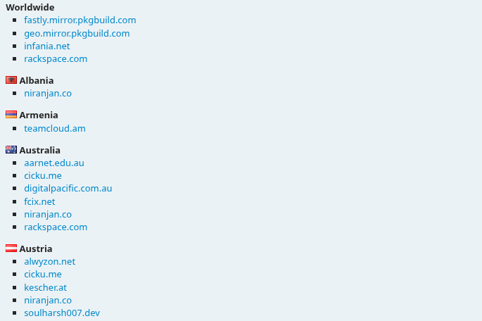
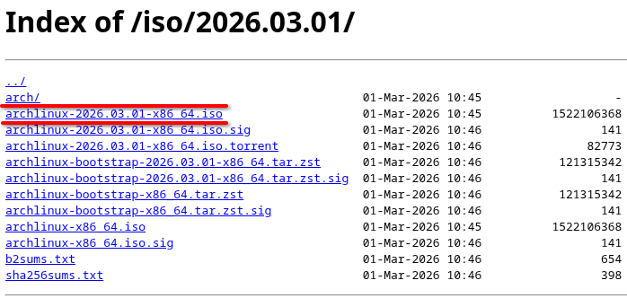
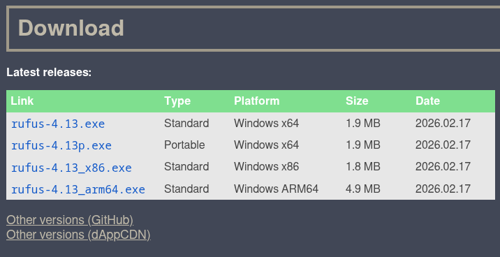
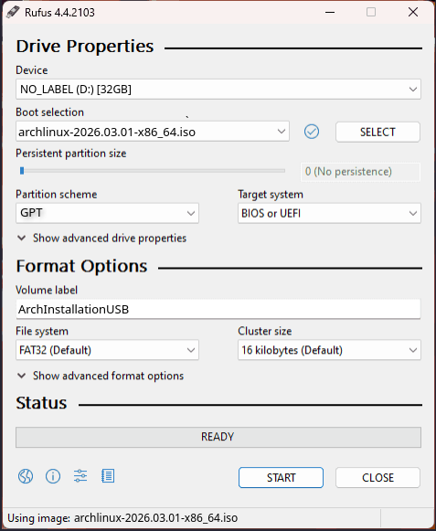
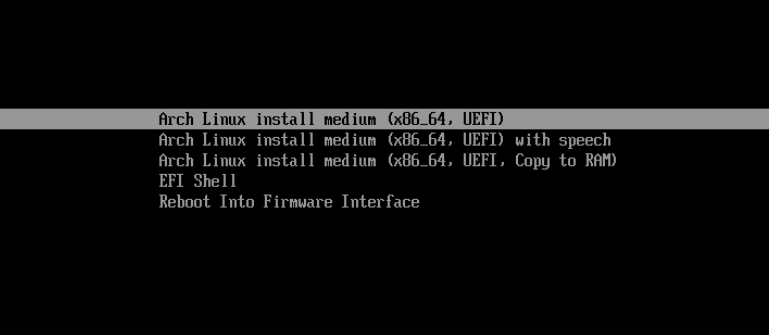
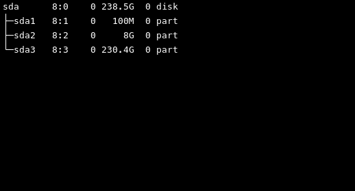
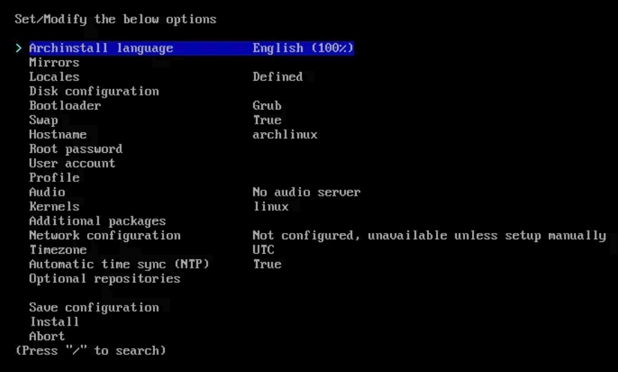
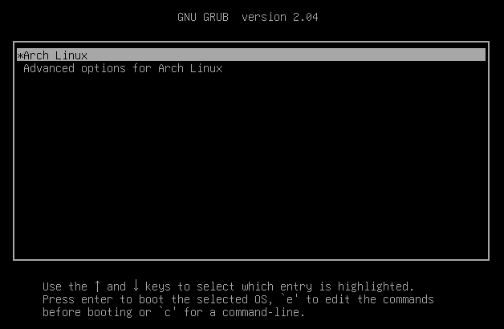

# Introduction
<div style="text-align: justify">
Hey there! since you are a beginner trying to install Arch Linux in your system for probably the first time, I will guide you through this process step by step and keep it as simplistic for you as possible. Keep in mind that this guide is aimed towards installing Arch as your only OS on the system and not for dual booting Arch along with your existing OS. Now then, let's begin the process.
</div>

## Downloading Pre-Requisites
So in order to install arch linux, we need three main components to begin:
1. Arch Linux iso
2. Rufus / Balena Etcher ( I will use rufus here )
3. A USB

### Download Arch Iso
<div style="text-align: justify">
So first let's download the arch linux iso from its official site
"<a target="_blank" href="https://archlinux.org/download/">Arch Linux Site</a>"
Go to this site and scroll down to the download links section. There will be alot of options for servers to download from, servers section should look like this:

I have provided a small screenshot but this list will be quiet long in reality. Now select the closest server to you for the best download speed. You will be shown a screen with several download links of Arch Linux, click the iso link as shown:

After this, your Arch iso will start downloading, now let's go on to rufus.
</div>

### Download Rufus
<div style="text-align: justify">
Rufus is a software used for creating a bootable USB, which we need to install arch from. Now in order to download rufus, let's go to the official rufus site
"<a target="_blank" href="https://rufus.ie/en/">Rufus Site</a>". Then scroll down to the download section and select any of the executables:

After this, rufus will start downloading in your system.
</div>

## Creating Bootable USB
<div style="text-align: justify">
After downloading the Arch iso and rufus, it's time to create a bootable USB. So start by plugging in your USB to the system. Now go to the folder where rufus was downloaded and launch the rufus exe file.
</div>

### Rufus Setup
<div style="text-align: justify">
Rufus will open a new window asking to fill the parameters for creating the bootable USB for your system, it will require fields such as the USB you want to work on and the iso you want to use. So select your plugged USB drive. Then for the second field which says (Boot selection), click on the select button on the right and look for the arch iso you downloaded previously. Select the arch iso and confirm it. After these two, you will be left with Partition Scheme  and Target System, select GPT for partition scheme and UEFI for target system. Now go to the Volume label field and give your USB a name like "ArchInstallationUSB". Leave the remaining options as it is. By the end of this whole setting process, your rufus should look a bit like this:

Your Device (USB) might be different than mine so it's ok if your selection appears a bit different. After doing all this, click start button on the bottom to start creating bootable USB. Now wait as this process will take a few minutes. When it says "Ready", congratulations! your bootable USB is ready to go.
</div>

## Booting Into Arch USB
<div style="text-align: justify">
Now that your USB is ready, we need to boot into it by doing three main steps:
<ol>
    <li>Change Boot Sequence</li>
    <li>Turn Off Secure Boot</li>
    <li>Turn Off Raid</li>
</ol> 
All three of these are done from the bios of our system, so we need to begin by going to the bios. For this process we will need to restart our system and from this point onward, we will not be returning to our desktop untill the Arch Linux has finished installing. Since Arch installation will wipe the disk clean, I would suggest you should backup the data from your disk onto another device or USB if it's important to you because otherwise, it will all be lost. After you are done with this, let's continue with the bios setup.
</div>

### Change Boot Sequence
<div style="text-align: justify">
So restart your system and keep pressing the bios setup key depending on your system, (Mostly it is Esc/F2/F12). After entering the bios setup we need to look for boot sequence setting. Now since bios is a sensitive part of your system where you should not play with settings that you dont know about, I would suggest searching on google about how to change boot sequence of your system with your respective model name since it is different for each system, however upon searching with your model name it will show up quiet easily. Upon finding your boot sequence setting, make sure that your ArchInstallationUSB is at the top of the list, if not then bring it to the top and apply changes to the bios.
</div>

### Turn Off Secure Boot
<div style="text-align: justify">
Now look for another setting called "Secure Boot", it will also be located in the boot settings of your bios. In order to make sure that Arch installation goes smoothly, "Secure Boot" should be disabled. Upon finding "Secure Boot" in your bios setup, disable it.
</div>

### Turn Off Raid
<div style="text-align: justify">
Now the final step before our Arch USB can be booted, we need to turn off "Raid", if "Raid" is enabled then sometimes the Arch USB will not be able to detect our Hard Drive at the time of disk configuration. Just like the "Secure Boot", the "Raid" option will also be located in your boot options. Upon finding it, turn of "Raid" and turn on "AHCI". After doing all this, we are ready to boot into our USB. Now confirm your changes and exit the bios, your system will automatically restart and if you have followed along with me correctly upto this point, you will be greeted by arch install USB as your bootable option as shown here:

Use your arrow keys to select the first option as shown in the this screenshot. Hit enter and wait for the system to boot into the Arch USB.
</div>

## Arch Installation
<div style="text-align: justify">
Now we are going to dive into the actual installation process of Arch Linux on our system. By now you should be on a command line interface and the system should be waiting for you to start entering the commands. First of all lets clear the screen to not be disturbed by all the pre-existing text, for this press "Ctrl + L", this will clear the terminal anytime of all the text. Now follow each command precisely to not face any difficulties during the installation.
</div>

### Connecting To Internet
<div style="text-align: justify">
We will need to install alot of pakages for our Arch Linux so we will need an internet connection. Let's check if we have one already by typing in our first command:
</div>

```bash
ping google.com
```

<div style="text-align: justify">
If you start receiving data packets then it means you have an internet connection established so skip to <a href="#sync-system-packages">Sync System Packages</a>, but if you receive an error message "Temporary Failure in name resolution" then type in the following command:
</div>

```bash
iwctl
```

<div style="text-align: justify">
This command is basically is our gateway to the internet, after running this command we will enter the iwctl CLI (command line interface), then we need to check our NIC (Network Interface Card). So now type the following:
</div>

```bash
device list
```

<div style="text-align: justify">
This will display the NIC of your system, for me it's wlan0 (your's might be something similar). Let's access more info about our NIC by running the next command, (replace wlan0 with your displayed NIC name):
</div>

```bash
device wlan0 show
```

<div style="text-align: justify">
You will get some additional info about you NIC. After this we need to run our next command, so type the following command to get a list of all the networks on our NIC, (replace wlan0 with your own NIC name):
</div>

```bash
station wlan0 get-networks
```

<div style="text-align: justify">
This will give us the list of the wifi networks that are detected by out NIC, now my wifi is called "HUAWEI-4bxW" so I will type the connect command next, (replace wlan0 and the wifi name with your own):
</div>

```bash
station wlan0 connect HUAWEI-4bxW
```

<div style="text-align: justify">
Terminal will prompt you to enter your wifi password so enter your password (it will appear as *s on the screen like):
</div>

```bash
Passphrase: *********
```

<div style="text-align: justify">
Hit the enter to confirm the password. If you dont see any output then you did it correctly. Now type in the exit command to leave iwctl:
</div>

```bash
exit
```

<div style="text-align: justify">
Now try the "ping google.com" command again to check if internet is connected correctly, this time you will start receiving data packets perfectly, upnext is the syncronization of system pakages.
</div>

### Sync System Packages
<div style="text-align: justify">
Now we need to synchronize system packages, for this we will run the following command:
</div>

```bash
pacman -Sy
```

<div style="text-align: justify">
After the above command finishes, run the following command:
</div>

```bash
pacman -Syy
```

<div style="text-align: justify">
By the time this command completes, your system packages should be synchronized. Now after this, we need to format the Drive and remove existing partitions.
</div>

### Format Disk
<div style="text-align: justify">
Clear the screen using "Ctrl+L", now let's start formatting the disk. Type the following command to display the list of your disk partitions:
</div>

```bash
lsblk
```

<div style="text-align: justify">
It should look something like:

Now from this list, identify your Drive that you need to install Arch on by looking at its size, and check its label, mine is "sda". So I will now need to format "sda". Your list might look totally different if you were previously running a difference OS. Either way, let's start formatting this drive. Type in the command to start the formatting process, (replace sda with your own disk):
</div>

```bash
gdisk /dev/sda
```

<div style="text-align: justify">
Now when it asks for "Command(? for help):", press "x" and hit enter. Then it will ask for "Expert command(? for help):", press "z" and hit enter again. Now it will ask for confirmation about wiping out the GPT on the drive. Press "y" or "Y" and hit enter. Lastly it will ask for confirmation about blanking out the MBR as well, press "y" of "Y" again and hit enter again. At this point, your drive will be free of any partitions and should be ready to install Arch on. You can confirm the formatting by typing in the "lsblk" command again.
</div>

### Setup Arch Install Script
<div style="text-align: justify">
Now after all this, type in the following command to check the authenticity and integrity of the Arch Linux packages, this command makes sure that the packages are trusted before installation:
</div>

```bash
pacman -Sy archlinux-keyring
```

<div style="text-align: justify">
After verifying the integrity of the packages, we need to setup the Arch install script. This can be done by typing in the following command:
</div>

```bash
pacman -Sy archinstall
```

<div style="text-align: justify">
It will ask you for confirmation, press "y" of "Y" and hit enter to confirm. Now we need to launch the Arch install script to initiate system configuration for Arch Linux. For this, type in the following command:
</div>

```bash
archinstall
```

### System Configuration
<div style="text-align: justify">
After running the "archinstall" command, you should now be on the system configuration menu of the Arch installer. Let's start configuring our installer.

First setting will be the "Language", set it to your preferred language.

Then leave the "Mirrors" untouched. "Locales" is used to setup your keyboard layouts and by default it will be US keyboard so I will leave it at that, you can change it if you want to.

Third will be the "Disk configuration", hit enter to go into the disk configuration. Then go into "Partitioning". Since this a guide for beginners let's go for the easiest option and select "Use a best-effort default partition layout". In this, Arch itself makes the simplest disk partition to setup its boot swap and remaining parition. Otherwise we would have to do that manually. Now select the drive where you want to install Arch by using arrow keys, for me it is /dev/sda. Press tab-key or space-bar on the drive to select it, hit enter. Then choose the btrfs file-system from the displayed menu, confirm by selecting "yes". Then select the "Use compression" from the displayed menu. Now select back to get back to main menu.

Next is the "Bootloader", go into it and select Grub as your bootloader.

Then there is "Swap", set it to true.

Set the "Hostname" as your liking. For now, let's go with "MyComputer".

Now go into the "Root password" to set your root password, save this password somewhere with you as this is really important for some actions with linux later on.

Then we need to create a "User account", go into it and select "Add a user" from the menu. Then enter a username for your user account, after that set a password for your user account (save this user password as well because you will constantly need it to login into your system after bootup). System will prompt you to select this account as superuser or sudo,  select "yes". Then select "Confirm and exit" to return to main menu.

After that, there is the "Profile". This is basically gonna be our desktop environment or you can say the "GUI" for desktop. Go into profile and select Desktop from the menu. A list of available Desktop-Environments will be displayed, you can even change this later on so for now I would suggest to select "KDE Plasma". Now you will see a menu to select "Graphics Driver" and "Greeter", go into "Graphics Driver" and select the driver based on your GPU, if you have an intel GPU select the "Intel (open-source)", similary if you have AMD or NVIDIA GPU then select the respective driver. Then go into "Greeter" and select "sddm" as your greeter. Now go back to main menu.

Now go into "Audio" and select "Pipewire" as your audio server and return to main menu.

Then we have "Kernal", you can install additional Kernals from here if you want but these are not neccessary so just skip it for now.

Then we have the "Additional Packages", you can install these packages after installation according to your need so for now skip this as well.

Now we are on "Network configuration". Go into it and select the "NetworkManager" and return to the main menu.

At last, we need to select the "Timezone", now this is gonna be different for you depending on where you live, so search on google for your timezone and select it from the menu here, now return to the main menu.

At this point we are done with our system configuration so make sure that you have selected everything correctly before going ahead. Also, after doing disk configuration, you might be getting another option called "Disk encryption" after it, ignore it. If everything else seems fine then go to the bottom of main menu and select "Install", it will ask for confirmation, hit enter to confirm, you will see a countdown and Arch Linux will take the wheel for a while now. This will take some time to setup and install everything so go and have a coffee or something untill it's done.
</div>

## Post Installation Steps
<div style="text-align: justify">
Congratulations! by now, you have successfully installed Arch Linux in your system so give yourself a pat on the back since this has been a hard journey up untill now. The only thing left is to perform some post installation steps to make the system usable as a daily driver so let's continue, by now your screen should have a prompt asking you "chroot into newly created installation and perform post-installation configuration?". Select "yes". Let's run a basic command again to make sure everything is upto par. Type in the following command:
</div>

```bash
pacman -Sy
```

<div style="text-align: justify">
After this finishes up, let's download some basic softwares that we will need for our daily use such as a browser and some other stuff. For this, run the following command:
</div>

```bash
pacman -Sy firefox libreoffice-fresh power-profiles-daemon vlc
```

<div style="text-align: justify">
The system will ask you for confirmation, press "y" or "Y" to confirm. Now wait while these packages get installed, since there are multiple softwares, this will take a while.

After this is done, type in the following command to exit chroot:
</div>

```bash
exit
```

<div style="text-align: justify">
Now we are done with the installation and setup so we need to restart our system and boot into our Hard Drive instead of the USB, so type in the following command to shutdown the system:
</div>

```bash
shutdown now
```

<div style="text-align: justify">
Now unplug the USB and start your system. If the system fails to load your Hard Drive, just go into bios again and edit the boot sequence to make sure that the Hard Drive is at the top of list, then apply and exit to boot into your Drive. You will be greeted with the grub bootloader menu:

Select "Arch Linux" and hit enter. You should now be on the login screen, enter your user account password that you had setup during the system configuration to login. Welcome to the Desktop, you have successfully installed Arch Linux in your system. You can open the terminal by pressing "Ctrl+Alt+T", have fun learning the Arch commands now. Thank you for reading my blog, hope it helped. I am retro and this has been a beautiful journey, Sayonara!
</div>