# Introduction
<div style="text-align: justify">
Hello There! and welcome to my blog about learning git and github as a beginner. Today we are going to dive into a really famous and also widely used version control system, which is git. Along with its helper-site that allows you to have a cloud space to manage a remote version of your project's code and other files. So without any further ado, let's dive into this tool shall we?
</div>

## Introduction To Git
<div style="text-align: justify">
As said before, git is a version control system for your project. But what does a version control system even mean ? A version control system is a system that allows you to track all the changes made in your project's files by keeping a log of its history. You can view this history any time using git commands. This also allows you to jump back to any older version of your project where you had not applied the latest changes.
</div>


### Benefits Of Using Git
<div style="text-align: justify">
Think of git as a safe system that allows you to manage your project in such a way that if anything goes wrong and your project starts to look like as if it is becoming a mess, you can just go back to a checkpoint where it was not a mess. Great thing isn't it ? Not to mention that git does all of this locally on your system meaning that the absence of an internet connection won't hinder your workflow at all, a developer's dream. When we get into github later on, we will also discuss an additional feature that git provides us in the domain of collaboration with a team during project management. However, all the features related to github will require a stable internet connection because github is a hosted site and doesn't run on our local machine unlike git itself.
</div>

### Git Installation
<div style="text-align: justify">
With that out of the way, let's start with how to setup git in our system. This is gonna be an easy process dont worry and just follow along step by step slowly. First of all we need to download git, we can do this by going to git's official download site at "<a target="_blank" href="https://git-scm.com/install/windows">Git Download Site</a>". You will see a page that looks like this.
</div>

<div style="text-align: justify">
Now if you are installing git on windows, you can download any of these setups and follow the on-screen instructions to install git on windows, you dont really need to change any configurations while running the setup, just keep pressing next until it starts the installation. Now if are installing git on Mac OS or a Debian Based Linux Distro, you can go to the Mac or Linux Tab and follow the given commands to install git. However, I am running Arch Linux and the git site doesn't provide the respective installation process so I will tell you how to do it on Arch as well. Dont worry, all you need is a single teminal command:

```bash
sudo pacman -S git
```
After this, you can also verify the git installation using the following command:

```bash
git --version
```
This command will show your installed version of git, this shows that git has been properly installed in your system and you are ready to move on with it. Now that we are done with installation of git, let's start with orientaion of github aswell to learn these tools in parallel and get the best out of them.
</div>

## Introduction To Github
<div style="text-align: justify">
github is basically a website that you can use in combination with git, this site allows you to have a cloud based management system for your projects. It also provides a more GUI approach towards git itself aswell. Where git manages your project locally, github manages it remotely. Basically when you use git and github together, your project is saved in two forms. These two forms are:
<ul>
<li>Local (On Your System)</li>
<li>Remote (On Your github)</li>
</ul>
Ideally, you should keep both of these in sync so that your project stays updated and there are no gaps between you local data and remote data. Also, git and github manage your project using Repositories. Repository is just a fancy name for a folder in github terminology. In short, a repository is also called a "Repo". So you have a Local Repo and a Remote Repo.
</div>


### Github Setup
<div style="text-align: justify">
Now that we have already installed git, let's setup our github so that we can get into learning them both. First you need to make an account on github by going to the official github site at "<a target="_blank" href="https://github.com">github Site</a>". Now you can make a github account by entering your email and clicking "Sign up for github" button, then you will need to verify your account using your email and the account will be created. Or if you already have a google account, you can use that to sign in aswell using the sign in option at the top right of this webpage as shown here.
</div>

<div style="text-align: justify">
Since I already have a google account, I will login using that account and then we will go through the github's understanding regarding its interface and all.
</div>

### Github GUI
<div style="text-align: justify">
When you sign in your github's interface might look quite empty as compared to mine. That is because your account is new and your haven't added much to it yet where as mine has been in use for quite a while now. Anyways, let's familiarize with github's GUI. Here is an image of my github's home page.
</div>

<div style="text-align: justify">
If you take a look at that list on the left side of my github's home page, these are my remote repositories that are managed by github. Even this blogsite that you are looking at right now, its code is being maintained using git and github, as you can see by looking at the bottom-most repo. So any repos that you will make are going to appear in this column later on. Then there is the "News/Updates" Section in the middle of the page which shows the latest updates of any activity on github. That should be all for the home interface for now. Let's configuring git.
</div>

## Git Configuration
<div style="text-align: justify">
When we are about to use git for the first time after installation, there are some one time commands that we need to run in order to configure git. First we need to tell it about the account that it will be handling on github remotely.
</div>

### Username & Email
<div style="text-align: justify">
For this, we need to provide it with the username and email of that account. Now my name is coder-Retro and email is hasnainqadri9c@gmail.com, but you shall replace my credentials with yours. Username and email are configured as:

```bash
git config --global user.name "coder-Retro"
git config --global user.email "hasnainqadri9c@gmail.com"
```
</div>

### Verification
<div style="text-align: justify">
Then you can also verify your configuration using the following git command:

```bash
git config --list
```
This will show the current configurred username and email that git is handling. After this one-time setup is done, let's create our first Local Repo using git.
</div>

## Repository Setup
<div style="text-align: justify">
In order to make a local repo, we need to make a folder on our system. Name this folder as your project's name for easy management and organization. For example if our porject is called Demo, then make a folder by the name "Demo". You can do this using command line by running the following command:

```bash
mkdir Demo
```
Then we need to enter this folder, you can do this by running the command:

```bash
cd Demo
```
</div>

### Local Repo
<div style="text-align: justify">
By now, we are inside our project folder, now we need to turn this folder into a local repo using git. We can use git's repo initializing command for this purpose, this command is the most basic git command and it goes like this:

```bash
git init
git branch -M main
```
What this does is that it turns the current folder into a local repo and the second command renames your current branch to "main", by default it's named as master. We will learn what a branch is when we get there, for now just let is slide and dont sweat it. Git starts monitoring any files in this folder (Local Repo) from now on. Hence, git is active and in action now.
</div>

### Remote Repo
<div style="text-align: justify">
After this we need to make a remote repo using github which we will then connect this local repo to. In order to create a remote repo, go to your github's home page and look for the "plus icon with a dropdown menu" in the navigation bar. Click the dropdown arrow and you will see the following options in the list that appears:
</div>

<div style="text-align: justify">
Select the "New repository" option. You will be greeted with repo creation page, name your remote repo same as your local repo for easy management. Since my local repo was named Demo, I will name remote as Demo too.
</div>

<div style="text-align: justify">
For now, dont change any other settings and just click on "Create repository" button at the bottom right. Now you will be greeted with a new page that contains our repo's HTTPS URL which we need to copy. We need this to connect our local repo to remote repo. Copy the URL by clicking at the following button:
</div>

<div style="text-align: justify">
Now we can go back to connect our local repo to remote repo using terminal.
</div>

### Connect Local to Remote
<div style="text-align: justify">
In order to connect our local repo to remote repo, run the following command but replace my repos HTTPS URL with your repo's:

```bash
git remote add origin https://github.com/coder-Retro/Demo.git
```
This command connects our local repo to the remote repo and allows the communication between both of them from now on, we can tranfer data from local to remote and vice versa now. Congratulations on making your first repository. Next up, we will learn how to add contents to our repos.
</div>

### Add Files to Local Repo
<div style="text-align: justify">
Let's create a simple cpp file in our local repo and then try to save it to our remote repo as well. Let's creat a simple test.cpp in our local repo:

```cpp
#include<iostream>
int main(){
    std::cout << "This is my Demo Project";
    return 0;
}
```
Now save this file in your local repo. Lets see if git is tracking our file or not. For this, run the command:

```bash
git status
```
You will see the following on your teminal:

```bash
On branch main
No commits yet

Untracked files:
  (use "git add <file>..." to include in what will be committed)
        .vscode/
        test.cpp

nothing added to commit but untracked files present
(use "git add" to track)
```
This means that git is not tracking your test.cpp yet, in order to make git track it, run the following command:

```bash
git add .
```
This command tells git to track all the files in the current folder. Now run the status command again and you will see this now:

```bash
On branch main
No commits yet
Changes to be committed:
  (use "git rm --cached <file>..." to unstage)
        new file:   test.cpp
```
This means that git has started tracking your test.cpp.
</div>

### Add Files to Remote Repo
<div style="text-align: justify">
Now let's save this file onto our remote repo as well using the following two commands:

```bash
git commit -m "Any Message"
git push origin main
```
The first command create a snap shot of your current added file. Then the second command sends that snap shot to the main branch in your remote repo.
</div>

#### Github Authentication
<div style="text-align: justify">
When you run git push origin main for the first time, your terminal will prompt you for a Username and Password. Do not enter your standard github account password! Since 2021, github requires a Personal Access Token (PAT) for command-line operations. Here is how to fix this. Go to your github settings:
<ol>
<li>Go to Developer settings</li>
<li>Go to Personal access tokens</li>
<li>Go to Tokens (classic)</li>
<li>Click "Generate new token (classic)</li>
<li>Give it a name (e.g., "GitCLI"), and check the repo box.</li>
<li>Click "Generate token" and copy it immediately</li>
<li>Note: You won't be able to see it again!</li>
<li>Enter this token when your terminal asks for your "Password."</li>
</ol>
After you are done with this procedure, run this command again.

```bash
git push origin main
```
Now if you go back to you github and open the Demo repo and refresh the page. You will see that your test.cpp has appeared in remote repo. Your will also see the text "Any Message" in front of it, this is called a commit message and people use it to determine what change they performed in the pushed file.
</div>


### Gitignore File
<div style="text-align: justify">
Now if you are using vscode as your editor, you might have noticed that a folder by the name of .vscode might have appeared aside from your test.cpp, vscode stores some language based settings in this folder. However we dont want to push this folder to our repo but it still appears when we try to push our test.cpp, so let's tell git to ignore this folder using a really usefull file that git offers us, ".gitignore". First, create a new file named exactly .gitignore in the root of your local project folder (make sure it starts with a dot and has no extension like .txt). Open it, type the following folder exclusion pattern in your ".gitignore":

```txt
.vscode/
```
Then save and close it. Now, because we ran git add . in our previous step, Git has already indexed and started tracking our .vscode/ folder! Simply creating a .gitignore file won't stop git from tracking files it has already noticed. We need to clear it from git's active tracking memory first. Run this specific sequence of commands to untrack the folder and push your new rules to github:

```bash
git rm -r --cached .vscode
git add .gitignore
git commit -m "Add: .vscode to gitignore"
git push origin main
```
The first command tells Git to safely drop .vscode/ from its tracking registry without deleting the actual files from your hard drive. The subsequent commands log your .gitignore rules into your history and upload them. If you open your remote repo on github, you will notice that the .vscode/ folder has vanished from the cloud while remaining fully intact on your machine. From this point forward, Git will silently ignore it on every single push. 
</div>
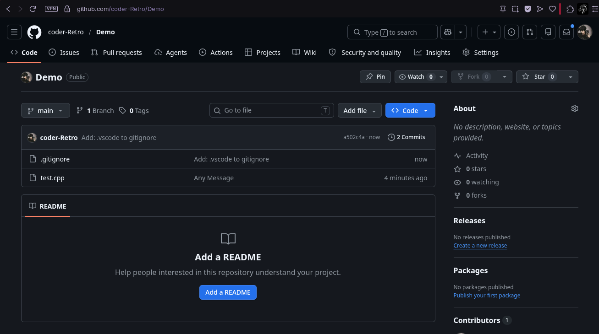
<div style="text-align: justify">
Just now, we pushed our code directly to main branch in the repo, for now it's ok since we are learning git and gitgub as beginners but later on we will learn how it is not recommended to push directly to main branch. In order to understand this, we need to learn what branches are and how to use them. But before moving on to that, I recommend taking a break and practice all that you have learnt up until now to let it sink in. When you have developed a good grasp on it, contiue to branches.
</div>

## Working Tree & Branches
<div style="text-align: justify">
When we are working on git and github, we need to know how it is structured and handled inside our repo, basically our entire project is organized similar to a tree structure and you can say the the branch that we just pushed our test.cpp to, yes the "main branch" is the trunk of this tree. Our main branch holds the deployed version of our project which means that all the code on our main branch, is deployed in the field. Then how do we add new features to it? How do we maintain the features without compromising the main deployed code? How do we test and experiment with new feature without ruining our actual project? That is where feature branches come in. A feature branch is basically a branch that diverges out of the main branch, we use this branch to create a separate copy of our project and work on that copy so that we dont modify the actual project on the main branch. When our modifications are completed and we have tested the new feature, we merge our feature branch back into our main branch to apply these new features to the deployed project. This entire branch structure is called a "Working Tree".
</div>
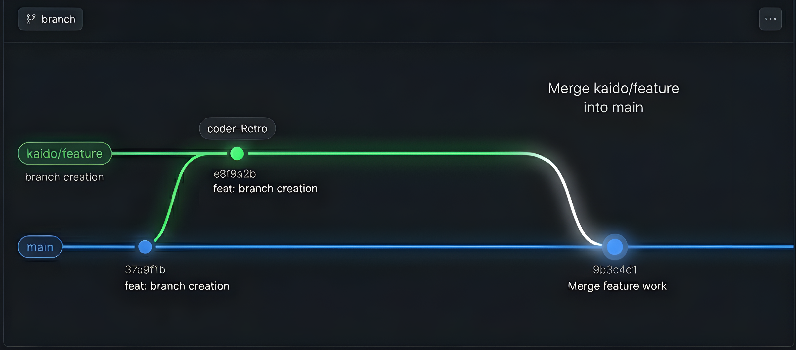
<div style="text-align: justify">
So basically when you are working on your project, it is preferred to make a feature branch and work on that so that your main project remains safe. And this is why it is not recommended to push directly onto the main branch as we did before. Now that we have learnt what a branch is, let's try to make one and then we will use that branch to add some more features to our test.cpp.
</div>

### Feature Branch
<div style="text-align: justify">
Before making our feature branch, it is a convention that we must sync our local repo to our remote repo. We can do this by running the following command in our terminal:

```bash
git switch main
git pull origin main
```
The first command makes sure that we are on our main branch. If you are already on the main branch, you can skip this command. Then the second command fetches the files from remote repo onto our local repo to make sure that our local repo has the latest updates before we start working on anything. First we need a name for our feature branch, for now we will name if "feature-branch". Now let's make our feature branch by running this command:

```bash
git switch -c feature-branch
```
This command not only make a new feature branch but also takes us to it. You can also check which branches your have in your repo and your currently active branch by running this command:

```bash
git branch
```
Your will see the list of all current branches on your repo and your currently active branch will be marked with a "*" symbol. My Demo Repo's branch list look like this right now:

```bash
* feature-branch
  main
```
The "*" symbol shows that I am currently working on the feature branch, you can switch between branches using any of the following two commands:

```bash
git checkout targetBranchName
git switch targetBranchName
```
Now anything we do on this feature branch will not modify the main branch itself. Let's verify this by editing the test.cpp on this feature branch. Open your test.cpp and add a line in the main function after the last cout:

```cpp
#include<iostream>
int main(){
    std::cout << "This is my Demo Project";
    std::cout << "\nThis is a Feature";
    return 0;
}
```
Save your file and then add, commit and push it to your feature branch using the previously learnt commands:

```bash
git add test.cpp
git commit -m "feat: Added Feature"
git push origin feature-branch
```
Now go to your github and open your test.cpp, your will see something like:
</div>
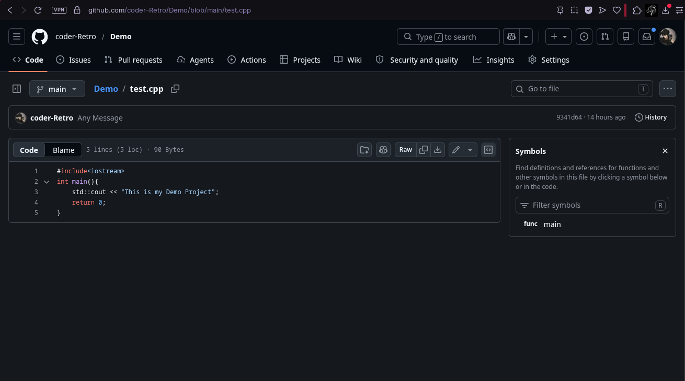
<div style="text-align: justify">
As you can see, the code hasn't changed. This is because we pushed the code to feature branch this time and not the main branch. Let's look at the code in our feature branch to see if our changes are showing there. You can do this by opening the branch drop down menu and selecting feature branch as shown:
</div>
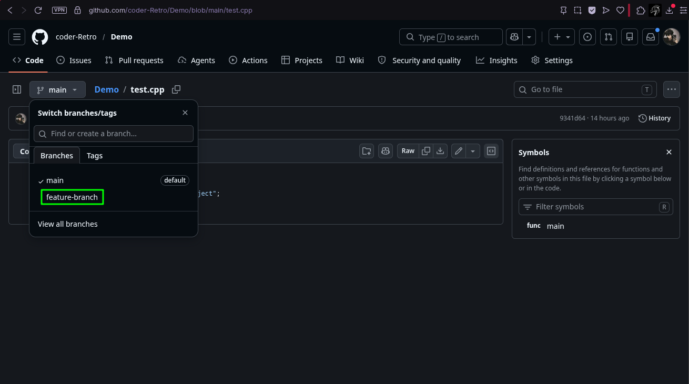
<div style="text-align: justify">
This will take you to your feature branch and now you can see the updated feature code that you have pushed to your feature branch. It should look something like this:
</div>
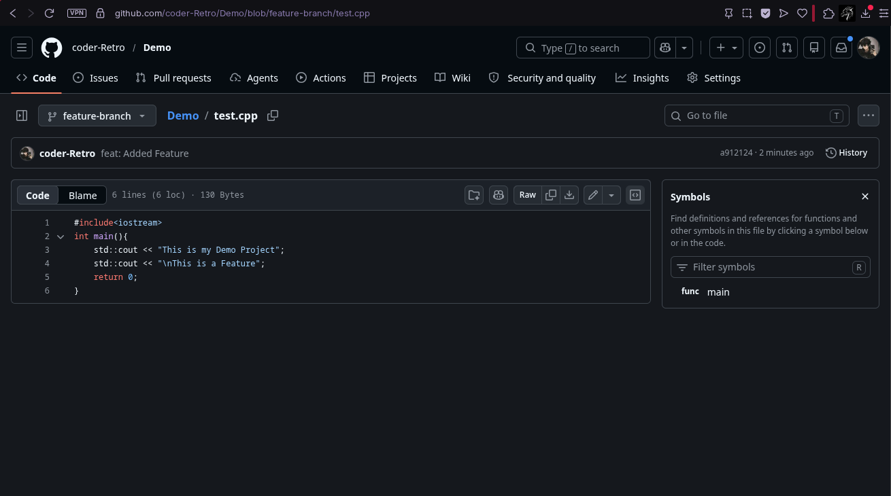

### Merge Feature Branch
<div style="text-align: justify">
So now, we know how to update our local repo to remote repo, make a feature branch and switch to it, modify file on the feature branch and push it to feature branch, how to view our feature branch on github. All while not disturbing the main branch. Now let's say that our feature is working perfectly fine and we know that it is ready to be deployed. Then we need to merge our feature branch back into main branch. There are two ways you can do this:
<ul>
<li>Through Command Line using git</li>
<li>Creating Pull Request using github</li>
</ul>
</div>

#### Git Method
<div style="text-align: justify">
If you are working on your project as a solo developer in your personal repository than git method is the most suitable for this scenario. For this, you need to first switch to your main branch and then run the merge command as:

```bash
git switch main
git merge feature-branch
git push origin main
```
The first command switches control to your main branch in local repo, the second command merges the updated files from your feature branch into your main branch in local repo, then the third command updates your remote repo's main branch with these modifications as well. You can verify these change by going onto your github and checking the file in main branch to see updates.
</div>

#### github Method
<div style="text-align: justify">
If your are working on a project with a team in a collaborative repository, it's preferred to use the github method which requires you to generate a "PR", which stands for "Pull Request". It is basically a sort of letter that carries your updated file from you feature branch attached with it. Your team first reads your file to make sure that it doesn't require any changes to be made before it goes into the main branch for merge. When you are provided a certains number of approvals by your team, then you are allowed to merge your feature branch back into main branch. This makes sure that one individual doesnt mistakenly alter the main branch without the approval of the team. Let's learn how to generate a PR now after pushing to our remote repo's feature branch. First, go to your remote repo on github. Your will see an option to "Compare and Create Pull Request" that came when you pushed to remote's feature branch. However if you dont see this option, simply click on "Pull Requests" as shown here:
</div>
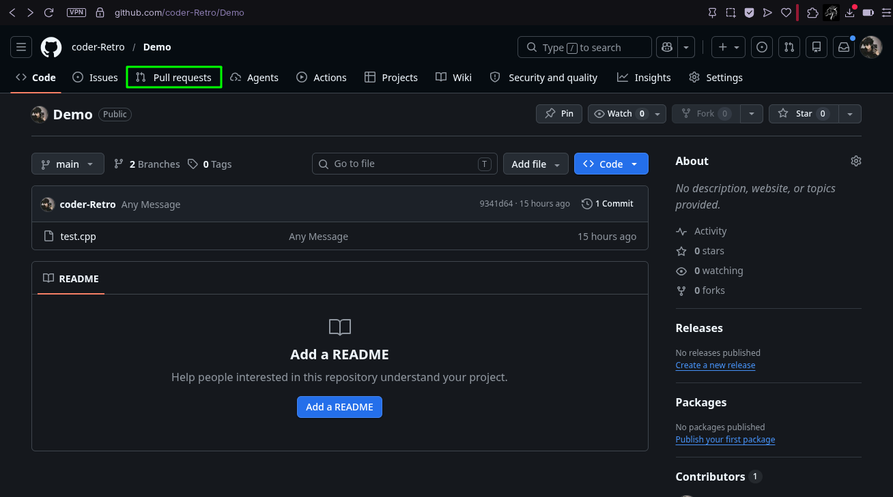
<div style="text-align: justify">
Then your will come to "PR section", from here you can generate your PR using the "New Pull Request" button at the top right of this section as shown in here.
</div>
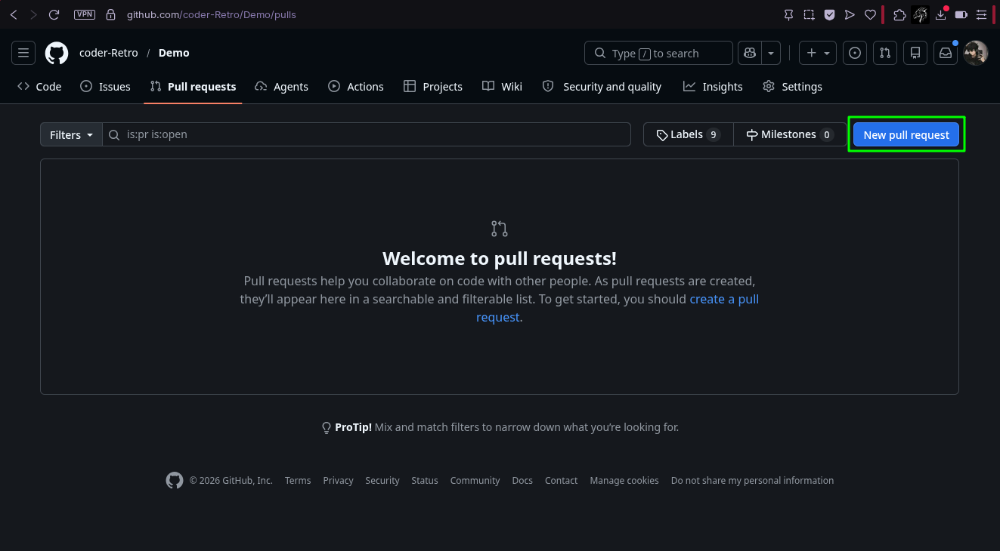
<div style="text-align: justify">
You will be greeted with the file that you are about to send along with your PR to be merged into the main, review the file and make sure that it is as you intended it to be, like my file has my added feature line in it as shown here:
</div>
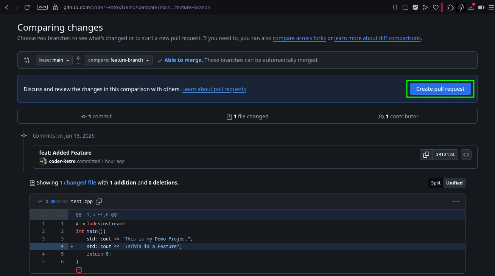
<div style="text-align: justify">
Then click on the "Create Pull Request" button at the top right of this section and you will be taken to the final configuration for your PR. Here you will select a title (first hightlight), then provide a description (second highlight) and finally click on "Create Pull Request" (third highlight) at the bottom of this page. This will finalise and submit your PR for your team to review before you can merge.
</div>
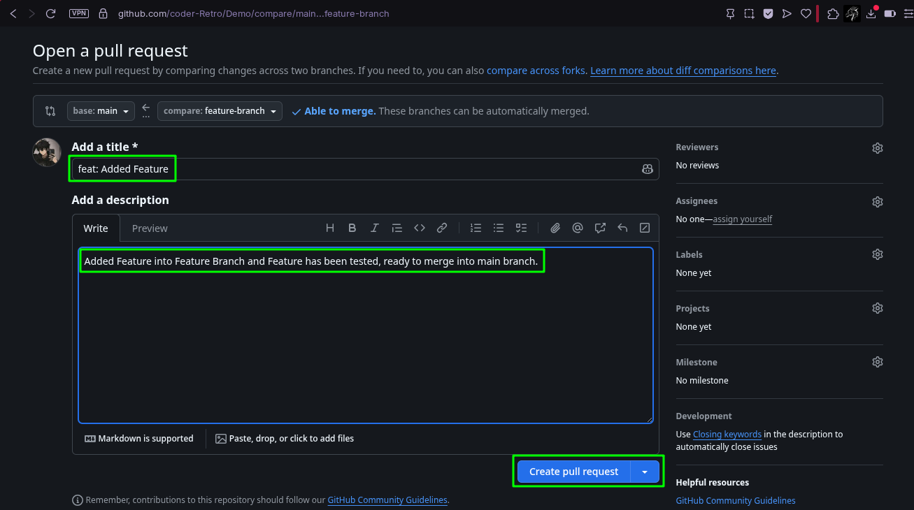
<div style="text-align: justify">
Now go back to "Pull Requests" tab and you will see your PR waiting there, click it to open it and check the current status of our PR. If you are working with an actual team in a collaborative Repo, you will see something like this in your PR:
</div>
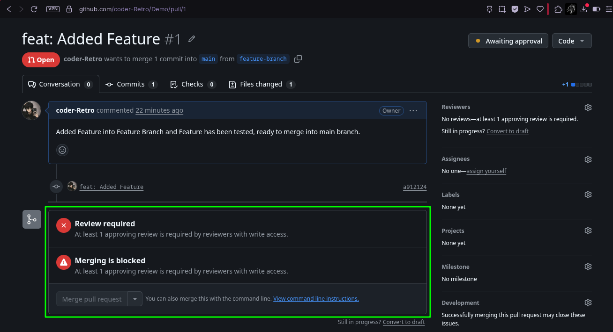
<div style="text-align: justify">
Merging will be blocked until a specified number of people from your team have approved your PR. For now, this is my own repo so I have set the number of required approvals to 1 and then I asked one of my amazing friends to volunteer as a reviewer for my PR. So I invited my friend "Velanora" as a collaborator in my Demo Repo. Let's add her as a reviewer on this PR so she can review and approve it for us which will allow us to merge our feature branch into main branch then. We can add her as a reviewer by selecting her from the "Reviewer's Menu" like this:
</div>
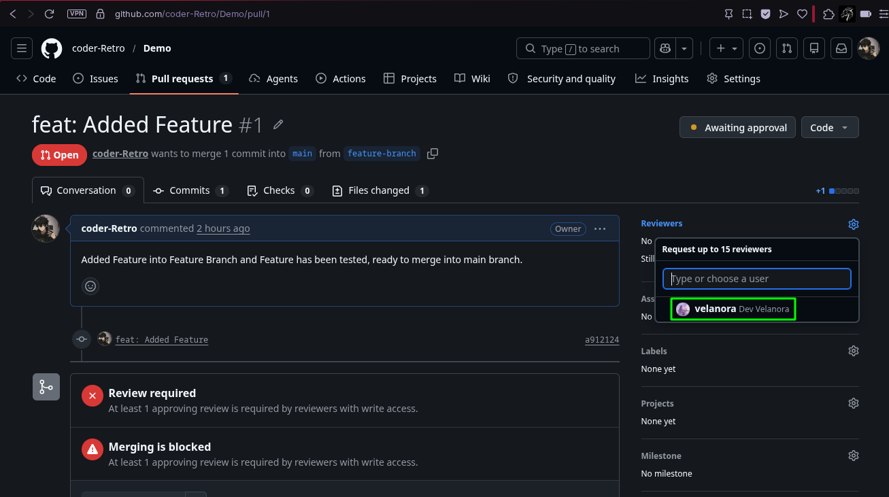
<div style="text-align: justify">
After we select a reviewer by clicking on them, we can save them by clicking outside the reviewer's menu. Our Reviewer will receive a notification from github telling them about their required approval in our PR. Then we will have to wait for them to review our PR. We can see that our reviewer has approved our PR or not by a symbol next to their name in Reviwer list on the right side. If the symbol is a yellow dot, they have not approved our PR, if the symbol is a blue/green tick, they have approved the PR.
</div>
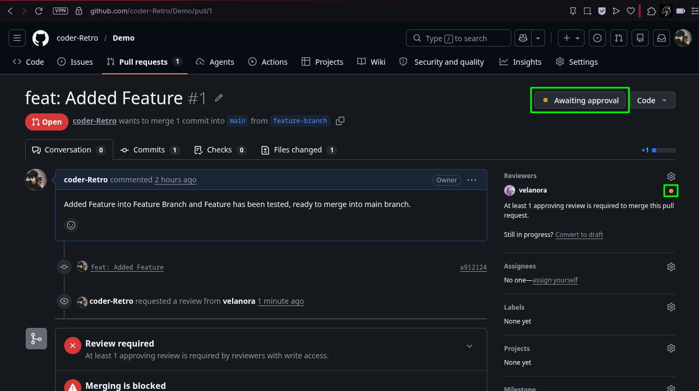
<div style="text-align: justify">
After reviewing, our reviewer can either request changes or they can approve it depending on the requirement of the project. If they request changes, we will still be barred from merging then, but if they approve our PR, yellow dot will be replaced with a blue/green tick and we will be allowed to merge.
</div>
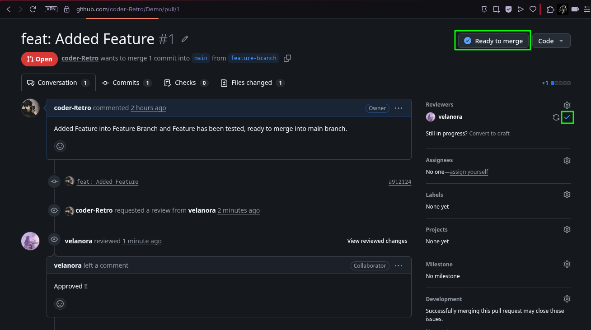
<div style="text-align: justify">
Once our PR has gotten the required amount of approvals, we can go back to our PR and we will see that our merge option has been unlocked. If everything has gone accordingly, our PR should have an unlocked merge option like this:
</div>
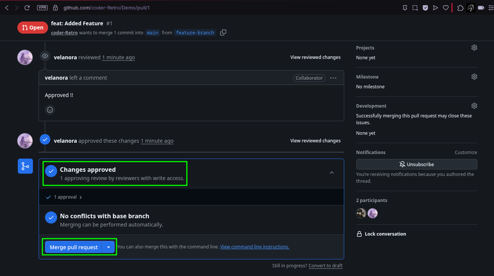
<div style="text-align: justify">
Now let's merge our PR by clicking on the "Merger Pull Request" button at the bottom, a dialogue box will appear where we have to provide a commit message, a description if we want and finally click the "Merge Pull Request" button like this one:
</div>
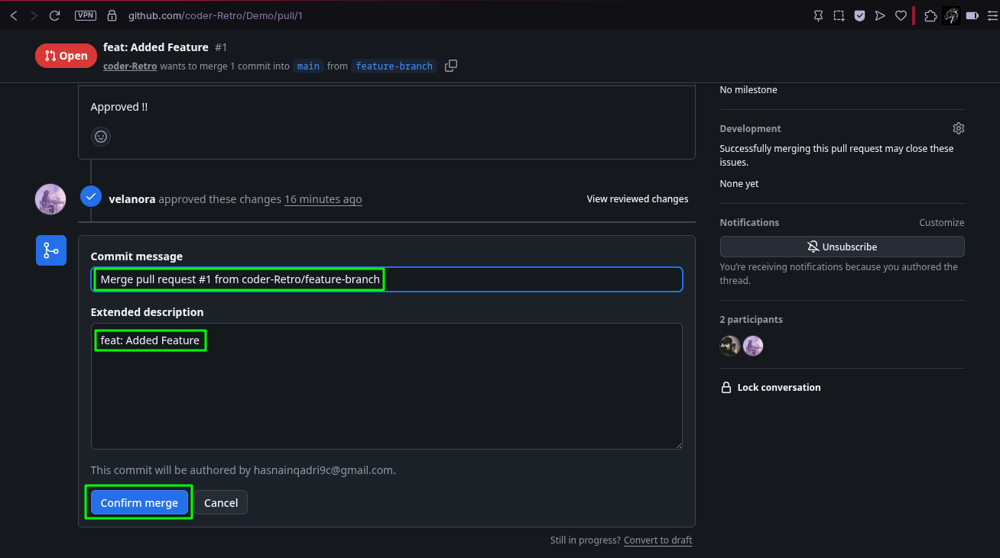
<div style="text-align: justify">
Then finally our PR will be merged into main and you will see this appear at the bottom of your PR:
</div>
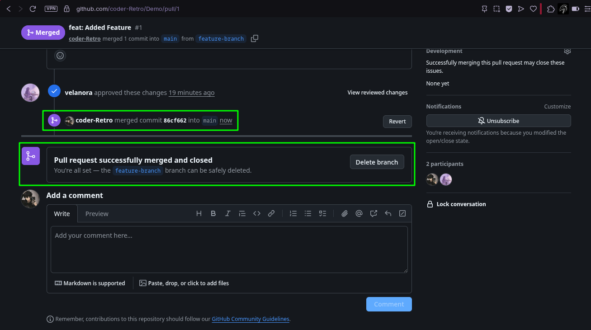
<div style="text-align: justify">
Now it is a convention to delete a branch after it has merged into main and completed the task it was supposed to do, but before deleting it let's see that our changes have safely merged into our main branch by going to main branch on github.
</div>
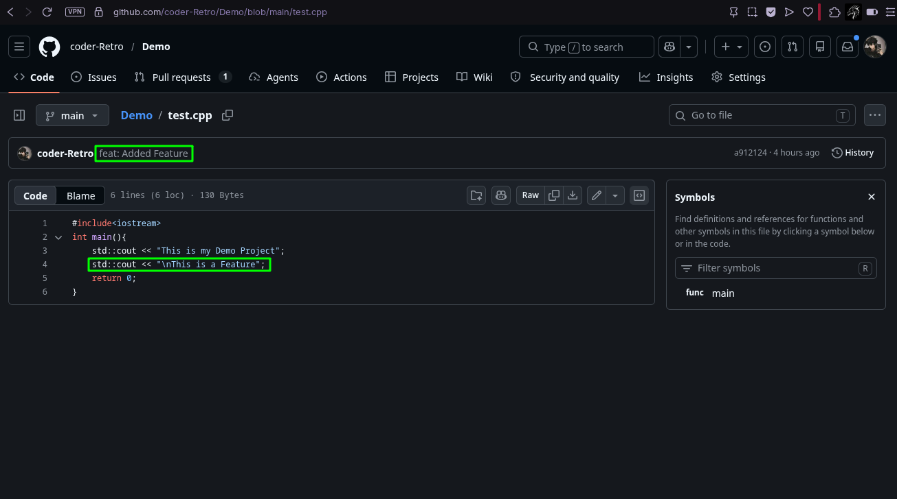

### Delete Feature Branch
<div style="text-align: justify">
As we can see that our main has successfully been updated and now we can safely delete our feature branch using the command line in our terminal. We will need the following commands:

```bash
git switch main
git pull origin main
git branch -d feature-branch
git push origin -d feature-branch
```
The first command will switch us to main because in order to delete a branch, we need to move to another branch as git does not allow you to delete your currently active branch. So first command will switch us to main. Then second command will update your local's main to remote's main (updated after merge). Then third command will delete our feature branch in our local repo. And finally fourth command will delete our feature branch from our remote repo on github. You can verify the deletion of your local repo's feature branch by running:

```bash
git branch
```
You will see that your feature branch is deleted in your local repo. Similarly you can verify the deletion of your remote feature branch by going to the branch switch menu of your repo on github:
</div>
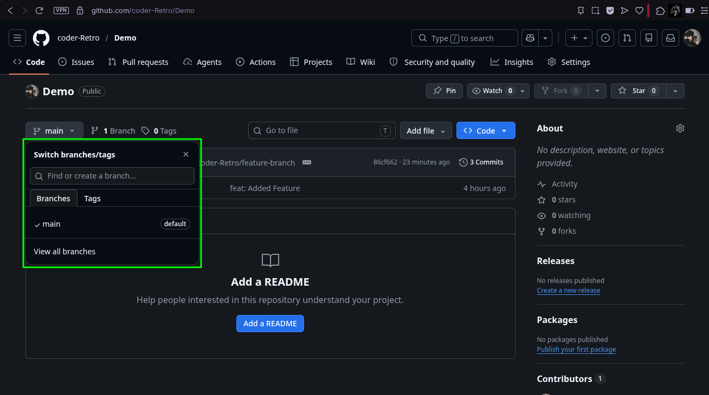
<div style="text-align: justify">
Congratulations! you have learnt how to create a feature branch, add a feature to your project, merge your branch using either git commands on your personal solo repo and by opening a PR on a collaborative repo. Then you also learnt how to delete your feature branch. Now you should take a break and practice all these concepts to let them sink in.
</div>

### Clone Repo
<div style="text-align: justify">
Now that we know how to make a repo from scratch, let's try working on a github repo that we find amusing due to any certain reason. This is called cloning. For this, we need to clone the repo, how to do that ? First go to the location in your system where you want to save it. Then run the following command:

```bash
git clone TargetRepoURL
```
You can find the repo's URL on github in the blue/green "Code Menu" when you open that repo, for example let's say we want to clone the Demo Repo we have been working on, then we would copy the given URL from the Repo on github and replace the "TargetRepoURL" with it:
</div>
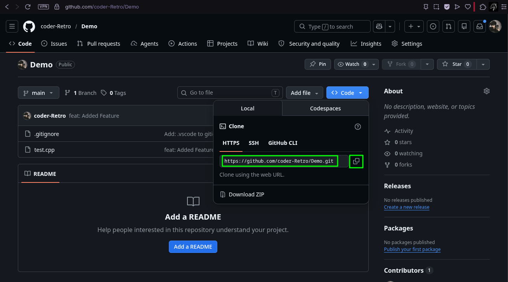
<div style="text-align: justify">
This command would clone the repo and then you can enter the local clone repo using:

```bash
cd TargetRepoName
```
However, do know that the repo might be owned by someone else and they might not have given you the rights to push anything to the remote repo like a collaborator could do. So you can play around with the local repo, but not the remote version of this cloned repo. Other than that, making branches and merging into main in your local repo is all the same as studied before. So now you know how to make a repo from scratch as well as how to clone a built one. Now we can move onto the actual core concepts of git and github, basically the version control part of it, that allows us to track the changes made to files in our project and also to load old checkpoints if needed.
</div>

## Basic Version Control
<div style="text-align: justify">
Version control as discussed before, allows us to go to different points in the history of our project's evolution. How to do this now. Lets say that we want to remove the feature that we added using our feature branch into test.cpp. We can use version control capability of git to revert the commit in which we added the feature. Let's learn how to do this. For this, we will need the commit hash of that version. How to find that ? We run a simple command:

```bash
git log
```
You will see the history of all the commits made to the project. My Demo Repo's History looks like this right now:

```bash
commit 6998eaa85661853059f2bd76249662a63df64ce8
(HEAD -> main, origin/main, origin/HEAD)

Author: coder-Retro <hasnainqadri9c@gmail.com>
Date:   Sun Jun 14 18:14:56 2026 +0500

    feat: Added Feature

commit a502c4a53ae37f001db0555b325fd3339f5db4bf
Author: coder-Retro <hasnainqadri9c@gmail.com>
Date:   Sun Jun 14 18:12:00 2026 +0500

    Add: .vscode to gitignore

commit 08964f140eee9b70a2f462094fd5947eb933d820
Author: coder-Retro <hasnainqadri9c@gmail.com>
Date:   Sun Jun 14 18:07:58 2026 +0500

    Any Message
```
If you want to start reading the commit history from the beginning of the project, then read the git log's output from bottom to upwards. As you can see here that there are only three commits. Initial commit that we made through our main branch (Any Message), second commit where we added the gitignore and the third commit that we made through our feature branch (feat: Added Feature). Git log also tells us the time those commits were made along with the attached commit message. Now back to commit hash that we needed. You see the first line of each commit that says "commit" and then a long code after it, this long code is called the "Commit Hash".
</div>

### Revert Commit
<div style="text-align: justify">
In order to revert our feature commit, we need its commit hash. We can look at the commit messages to know where we want to go. The last commit says "feat: Added Feature", so that's the one we need to revert. Let's copy the commit hash of this commit. Now in order to remove a feature, we must make a new branch like we made one to add it. Let's revise the branch making process shall we? First sync you local main with remote main using:

```bash
git switch main
git pull origin main
```
Then make a branch using the branch creation command and also switch to it. Let's call this branch "remove-feature":

```bash
git switch -c remove-feature
```
Now let's run branch list command to make sure that our branch has been created and we are on the current branch:

```bash
git branch
```
It should look something like this:

```bash
* remove-feature
  main
```
Not let's use our copied commit hash to revert the feature. For this, we need to run this command using our commit hash:

```bash
git revert --no-edit 6998eaa85661853059f2bd76249662a63df64ce8
git push origin remove-feature
```
Normally "git revert CommitHash" would have also worked, but sometime you will get an error regarding an editor called "vi" which might not be installed in your system, so to bypass that error we use the "no-edit" flag. Now the test.cpp in the remove-feature branch of our repo has been restored to its original form where the feature did not exist.
</div>
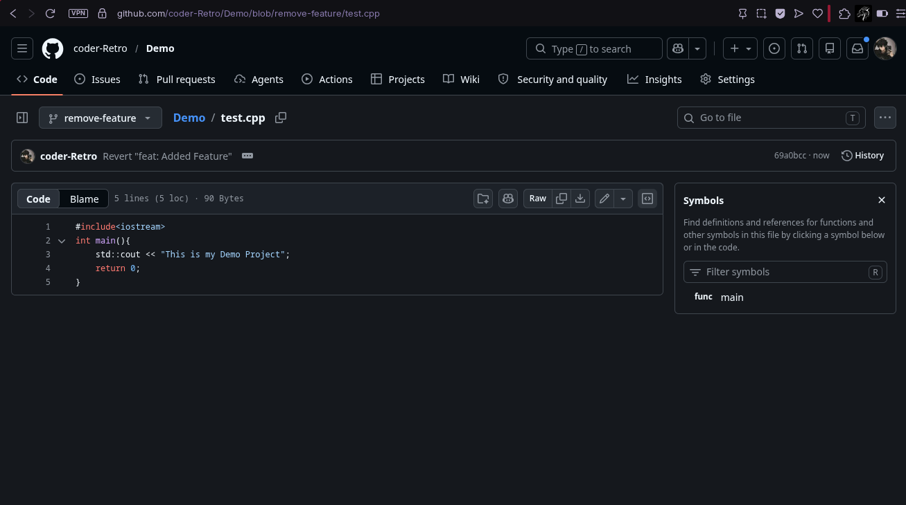
<div style="text-align: justify">
Now let's merge our remove-feature into our main to restore the original code as well:

```bash
git switch main
git merge remove-feature
git push origin main
```
The first command will switch to main branch in local repo, the second command will merge the remove-feature of local repo into main branch of local repo and finally third command will update the code on remote repo's main branch using the local repo's main. Now let's run git log to verify if our feature has been removed, you will see this:

```bash
commit 69a0bcc56c2173ab9e01ad92fcc1fe7f872adb3d
Author: coder-Retro <hasnainqadri9c@gmail.com>
Date:   Sun Jun 14 21:53:54 2026 +0500

    Revert "feat: Added Feature"
    
    This reverts commit 6998eaa85661853059f2bd76249662a63df64ce8.

commit 6998eaa85661853059f2bd76249662a63df64ce8
Author: coder-Retro <hasnainqadri9c@gmail.com>
Date:   Sun Jun 14 18:14:56 2026 +0500

    feat: Added Feature

commit a502c4a53ae37f001db0555b325fd3339f5db4bf
Author: coder-Retro <hasnainqadri9c@gmail.com>
Date:   Sun Jun 14 18:12:00 2026 +0500

    Add: .vscode to gitignore

commit 08964f140eee9b70a2f462094fd5947eb933d820
Author: coder-Retro <hasnainqadri9c@gmail.com>
Date:   Sun Jun 14 18:07:58 2026 +0500

    Any Message
```
As you can see that the latest commit says (Revert "feat: Added Feature"). You can also verify the feature removal by going to remote repo's main:
</div>
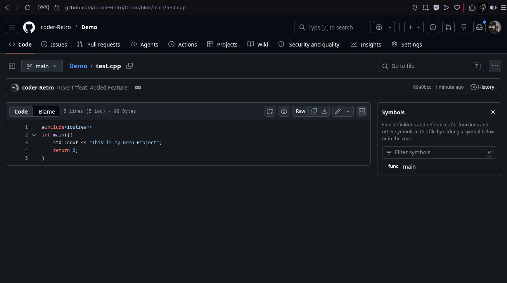

### Cleanup
<div style="text-align: justify">
As we can see that our feature has been reverted all over our project and initial form of code has been restored. Now all we have left to do is to delete our remove-feature branch to cleanup. Let's revise the branch deletion process by running the following commands:

```bash
git switch main
git pull origin main
git branch -d remove-feature
git push origin -d remove-feature
```
We already know what each of these commands do step by step. Congratulations on reverting your feature and restoring an older version of your project. This is one of the most important and amazing powers a developer can desire to have and that is exactly what git and github deliver.
</div>

## Advanced Version Control
<div style="text-align: justify">
That was not much to revert a single commit and restore the code. However, lets learn how to undo multiple commits that were made after a certain point. For this, we will add 3 features using 3 branches. We will use separate names for these branches (i.e feature-1, feature-2 and feature-3). Then we will restore the code to the point where only the feature of feature-1 was added and remove features added by feature-2 and feature-3. Let's make these branches and add the features first.

```bash
git switch main
git pull origin main
git switch -c feature-1
```
Then add the feature in your cpp using feature-1:

```cpp
#include<iostream>
int main(){
    std::cout << "This is my Demo Project";
    std::cout << "\nThis is Feature 1";
    return 0;
}
```
Now save it, push it onto remote's feature-1, then merge it into main and delete your feature-1 using:

```bash
git add test.cpp
git commit -m "Add: First Feature"
git push origin feature-1
git switch main
git merge feature-1
git push origin main
git branch -d feature-1
git push origin -d feature-1
```
By now, first feature has been added and feature-1 has been deleted from local and remote repo. Let's add second feature by making feature-2 branch:Now since we are already on main and we know that our local's main is updated with remote's main, we will skip the "git switch main" and "git pull origin main" command. This is important to know which command does what and whether we need to run it or not:

```bash
git switch -c feature-2
```
Then add the second feature to your test.cpp like:

```cpp
#include<iostream>
int main(){
    std::cout << "This is my Demo Project";
    std::cout << "\nThis is Feature 1";
    std::cout << "\nThis is Feature 2";
    return 0;
}
```
Now save test.cpp and repeat the same push and merge process for feature-2 as well:

```bash
git add test.cpp
git commit -m "Add: Second Feature"
git push origin feature-2
git switch main
git merge feature-2
git branch -d feature-2
git push origin -d feature-2
```
I have demonstrated the process two times for First and Second feature. Now add the Third Feature using feature-3 branch yourself. By the end, we will be on our main branch, all feature branches will be deleted and your test.cpp will look like this:

```cpp
#include<iostream>
int main(){
    std::cout << "This is my Demo Project";
    std::cout << "\nThis is Feature 1";
    std::cout << "\nThis is Feature 2";
    std::cout << "\nThis is Feature 3";
    return 0;
}
```
So we added three features using 3 feature branches, now we need to learn how to remove everything added to our project ahead of a certain point. For now, let's set this point as First Feature, which means that we will restore the project to the point where First Feature was added and anything added after that (Second Feature and Third Feature) will be removed. This is gonna be different than reverting, where reverting only undid a single commit, this will undo all the commits made after "Add: First Feature", therefore the successive "Add: Second Feature" & "Add: Third Feature" commits will be undone. Let's get down to it then. 
</div>

### Retrieve CommitHash
<div style="text-align: justify">
In order to restore our project to a certain point, we will need the commit hash of that point. We already know how we can get the commit hash using git log. Now since we need the commit hash of First Feature, we will need to search for the First Feature commit in the git log's history. But since we have been using clean commit messages for each commit, we will be able to locate First Feature's commit in no time. Let's open the project's commit history using:

```bash
git log
```
And we will be greeted with the history of commits of our project. Let's look for the First Feature commit by searching through the commits using commit messages as a key. We are looking for a message that says "Add: First Feature".

```bash
commit f3e2cd94b60ff4845dd3c80851a0f2ce6f6dd55f
(HEAD -> main, origin/main, origin/HEAD)
Author: coder-Retro <hasnainqadri9c@gmail.com>
Date:   Tue Jun 16 19:33:09 2026 +0500

    Add: Third Feature

commit a65d42aad6606b6c8aaae3d649ec45735f76ad4c
Author: coder-Retro <hasnainqadri9c@gmail.com>
Date:   Tue Jun 16 19:31:42 2026 +0500

    Add: Second Feature

commit fe312a3b08b8d16a3ac6a110a987d8a0ef307a0c
Author: coder-Retro <hasnainqadri9c@gmail.com>
Date:   Tue Jun 16 19:29:53 2026 +0500

    Add: First Feature

commit 69a0bcc56c2173ab9e01ad92fcc1fe7f872adb3d
Author: coder-Retro <hasnainqadri9c@gmail.com>
Date:   Sun Jun 14 21:53:54 2026 +0500

    Revert "feat: Added Feature"
    
    This reverts commit 6998eaa85661853059f2bd76249662a63df64ce8.

commit 6998eaa85661853059f2bd76249662a63df64ce8
Author: coder-Retro <hasnainqadri9c@gmail.com>
Date:   Sun Jun 14 18:14:56 2026 +0500

    feat: Added Feature

commit a502c4a53ae37f001db0555b325fd3339f5db4bf
Author: coder-Retro <hasnainqadri9c@gmail.com>
Date:   Sun Jun 14 18:12:00 2026 +0500

    Add: .vscode to gitignore

commit 08964f140eee9b70a2f462094fd5947eb933d820
Author: coder-Retro <hasnainqadri9c@gmail.com>
Date:   Sun Jun 14 18:07:58 2026 +0500

    Any Message
```
There it is, the commit message "Add: First Feature". We will now copy its commit hash. Now after that, we need to start restoration to this commit hash.
</div>

### Restoration
<div style="text-align: justify">
Now let's make another branch to start our retoration safely, let's name this branch as "restore-branch":

```bash
git switch -c restore-branch
```
Now we have to restore our project for First Feature on this branch and then update main branch using this branch as reference. We can do this by first restoring the code on our restore-branch by using the following command with First Feature's commit hash:
> [!WARNING]
> **Data Loss:** The upcoming command contains a "hard" flag, which is a destructive flag. It completely wipes out files in your local directory and also wipes the git log history of the successive commits. Make sure you don't have uncommitted code that you dont want to lost before running this next command!

```bash
git reset --hard fe312a3b08b8d16a3ac6a110a987d8a0ef307a0c
```
What this will do? this will make the test.cpp on your restore-branch to the exact state as when First Feature was added, "hard" flag is the thing responsible for restoring the physical file to this point, if you use "soft" flag then your file would be staged as First Feature commit, but the physical code would not have been lost in your code editor. Anyways, "hard" resets the file to that commit. You can verify this by the absence of Second and Third Features in your test.cpp file in your code editor. Now we just need to update main using this restore-branch. We can do that by running the following commands:

> [!WARNING]
> **History Rewriting:** The upcoming commands contain a "force" flag which is capable of altering the remote repo's history of commits made in the project, so before using this flag make sure that you dont lose any neccessary data in your project's history log which might be needed later. In a professional repo with a team, force-pushing to a shared tracking branch like main is usually strictly forbidden because it can disrupt your team's local environments. Only use it on your personal or isolated feature branches!

```bash
git push origin restore-branch --force
git switch main
git reset --hard restore-branch
git push origin main --force
```
The first command, you already know what it does but that "force" flag is new for you right? Well github has a simple rule called the forward-movement principle. It only expects the user to move forward by keeping all the previous commits and adding new ones ahead of it. But here, we just restored the restore-branch to an older commit which removed the successive commits (Second Feature & Third Feature), now if we push to github, this will be a backward-movement which github sees as a mistake by the user. So by adding "force" flag, we are telling github that "I know what I am doing so just listen to me and do it". This allows github to know that this backward-movement is intensional and not a mistake so github breaks its forward-movement principle and allows us to go back to an old point and remove the successive commits ahead of that point. It will also remove the Second Feature and Third Feature's commits from our project's git log history as well. That's what the "force" flag does. The second command then switches to main as you know already. The third command updated the local's main to local's restore branch. The fourth command then updates remote's main using local's main, and "force" flag is again used for the same reason here. Now let's run git log to check the history:

```bash
commit fe312a3b08b8d16a3ac6a110a987d8a0ef307a0c
Author: coder-Retro <hasnainqadri9c@gmail.com>
Date:   Tue Jun 16 19:29:53 2026 +0500

    Add: First Feature

commit 69a0bcc56c2173ab9e01ad92fcc1fe7f872adb3d
Author: coder-Retro <hasnainqadri9c@gmail.com>
Date:   Sun Jun 14 21:53:54 2026 +0500

    Revert "feat: Added Feature"
    
    This reverts commit 6998eaa85661853059f2bd76249662a63df64ce8.

commit 6998eaa85661853059f2bd76249662a63df64ce8
Author: coder-Retro <hasnainqadri9c@gmail.com>
Date:   Sun Jun 14 18:14:56 2026 +0500

    feat: Added Feature

commit a502c4a53ae37f001db0555b325fd3339f5db4bf
Author: coder-Retro <hasnainqadri9c@gmail.com>
Date:   Sun Jun 14 18:12:00 2026 +0500

    Add: .vscode to gitignore

commit 08964f140eee9b70a2f462094fd5947eb933d820
Author: coder-Retro <hasnainqadri9c@gmail.com>
Date:   Sun Jun 14 18:07:58 2026 +0500

    Any Message
```
As you can see, lastest commit is First Feature now and successive commits have been removed. You can also verify the change in you remote repo's main.
</div>
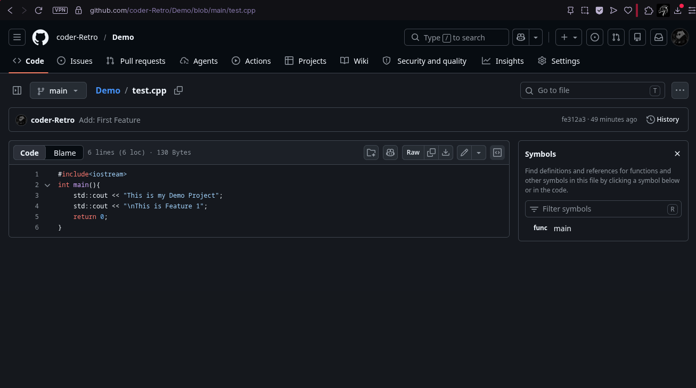

### Cleanup
<div style="text-align: justify">
Now that we have verified the restoration, let's perform the cleanup by deleting our restore branch from both local and remote repo. Again, I will skip the "git switch main" and "git pull origin main" because I am already on main branch so dont need to switch, and also main hasnt been changed after the last update to dont need to pull from remote's main:

```bash
git branch -d restore-branch
git push origin -d restore-branch
```
There we go, project restored to intended point and all cleaned up. Again, I would recommend to take a break here and practice what you have learnt in Basic and Advanced Version Control to get a good understanding of it. After that, we will move onto our last topic of this git & github guide, which is "Merge Conflicts".
</div>

## Merge Conflict
<div style="text-align: justify">

</div>