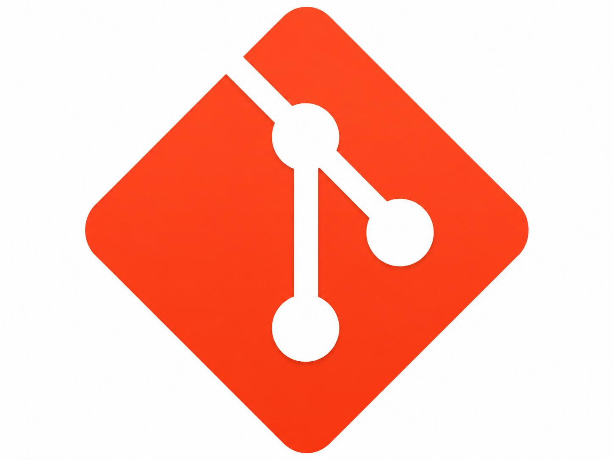
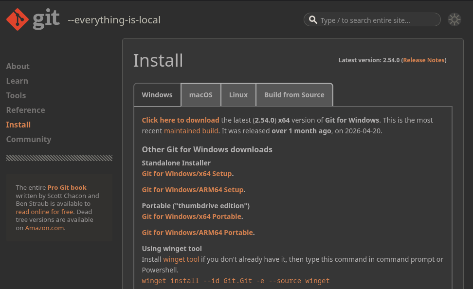
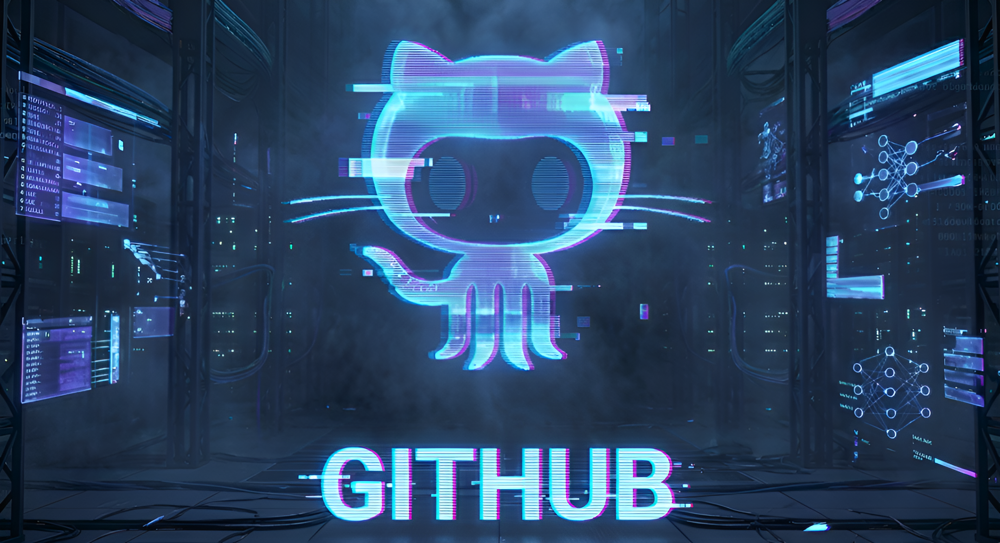
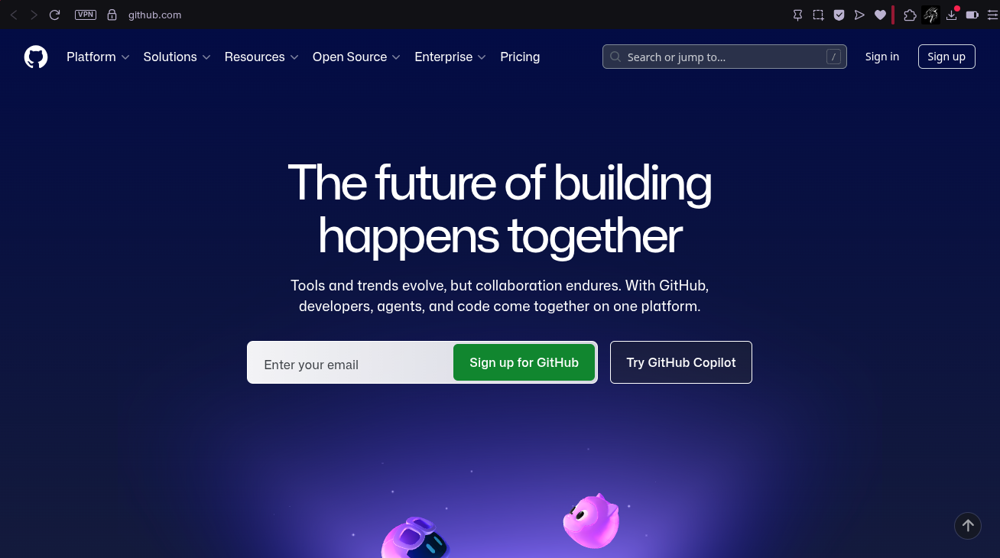
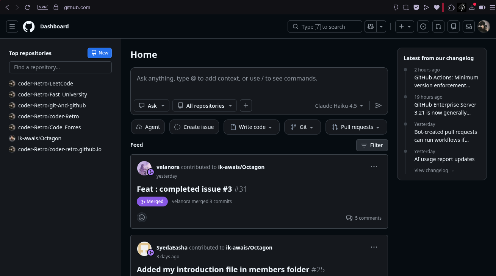
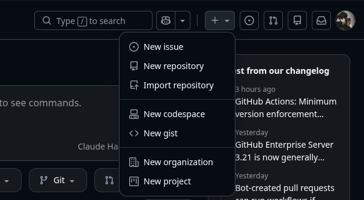
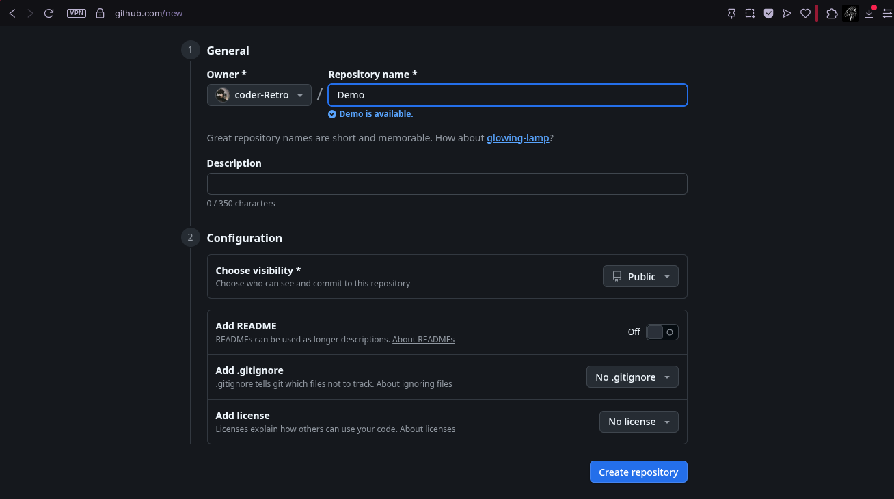
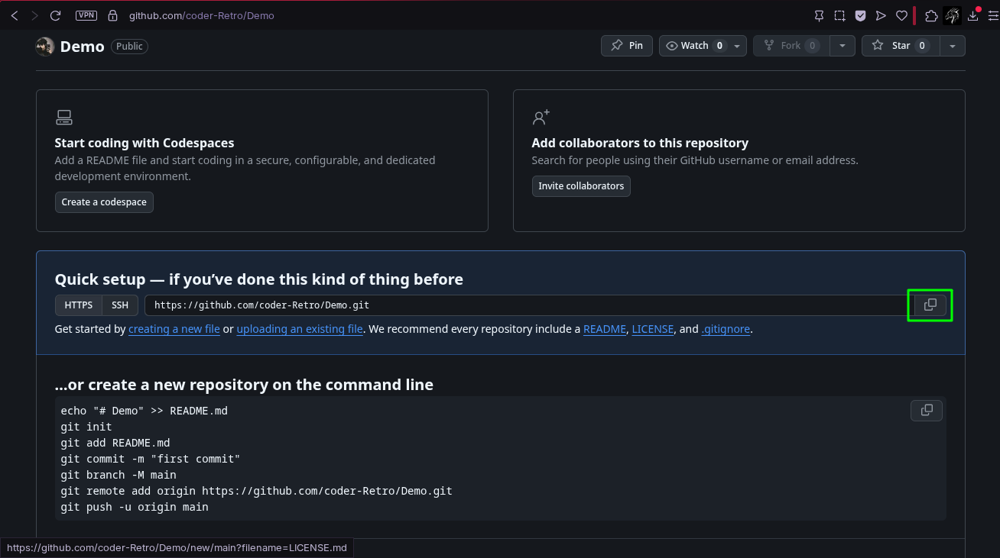
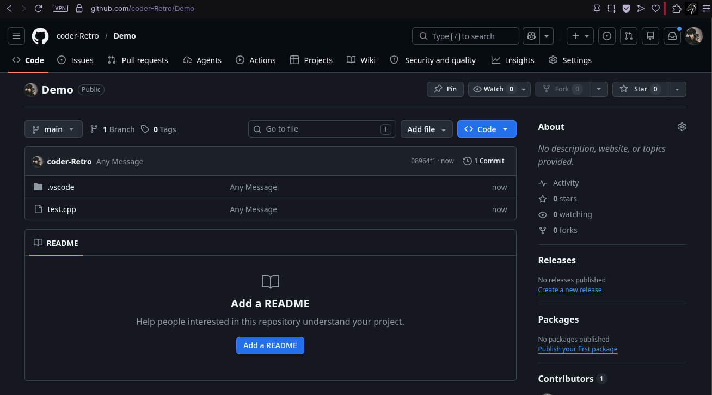

# Introduction
<div style="text-align: justify">
Hello There! and welcome to my blog about learning git and github as a beginner. Today we are going to dive into a really famous and also widely used version control system, which is git. Along with its helper-site that allows you to have a cloud space to manage a remote version of your project's code and other files. So without any further adue, let's dive into this tool shall we?
</div>

## Introduction To Git
<div style="text-align: justify">
As said before, git is a version control system for your project. But what does a version control system even mean ? A version control system is a system that allows you to track all the changes made in your project's files by keeping a log of its history. You can view this history any time using git commands. This also allows you to jump back to any older version of your project where you had not applied the latest changes.
</div>


### Benefits Of Using Git
<div style="text-align: justify">
Think of git as a safe system that allows you to manage your project in such a way that if anything goes wrong and your project starts to look like as if it is becoming a mess, you can just go back to a checkpoint where it was not a mess. Great thing isn't it ? Not to mention that git does all of this locally on your system meaning that the absence of an internet connection won't hinder your workflow at all, a developer's dream. When we get into github later on, we will also discuss an additional feature that git provides us in the domain of collaboration with a team during project management. However, all the features related to github will require a stable internet connection because github is a hosted site and doesn't run on our local machine unlike git itself.
</div>

### Git Installation
<div style="text-align: justify">
With that out of the way, let's start with how to setup git in our system. This is gonna be an easy process dont worry and just follow along step by step slowly. First of all we need to download git, we can do this by going to git's official download site at "<a target="_blank" href="https://git-scm.com/install/windows">Git Download Site</a>". You will see a page that looks like this.
</div>

<div style="text-align: justify">
Now if you are installing git on windows, you can download any of these setups and follow the on-screen instructions to install git on windows, you dont really need to change any configurations while running the setup, just keep pressing next until it starts the installation. Now if are installing git on Mac OS or a Debian Based Linux Distro, you can go to the Mac or Linux Tab and follow the given commands to install git. However, I am running Arch Linux and the git site doesn't provide the respective installation process so I will tell you how to do it on Arch as well. Dont worry, all you need is a single teminal command:

```bash
sudo pacman -S git
```
After this, you can also verify the git installation using the following command:

```bash
git --version
```
This command will show your installed version of git, this shows that git has been properly installed in your system and you are ready to move on with it. Now that we are done with installation of git, let's start with orientaion of github aswell to learn these tools in parallel and get the best out of them.
</div>

## Introduction To Github
<div style="text-align: justify">
Github is basically a website that you can use in combination with git, this site allows you to have a cloud based management system for your projects. It also provides a more GUI approach towards git itself aswell. Where git manages your project locally, github manages it remotely. Basically when you use git and github together, your project is saved in two forms. These two forms are:
<ul>
<li>Local (On Your System)</li>
<li>Remote (On Your Github)</li>
</ul>
Ideally, you should keep both of these in sync so that your project stays updated and there are no gaps between you local data and remote data. Also, git and github manage your project using Repositories. Repository is just a fancy name for a folder in github terminology. In short, a repository is also called a "Repo". So you have a Local Repo and a Remote Repo.
</div>


### Github Setup
<div style="text-align: justify">
Now that we have already installed git, let's setup our github so that we can get into learning them both. First you need to make an account on github by going to the official github site at "<a target="_blank" href="https://github.com">Github Site</a>". Now you can make a github account by entering your email and clicking "Sign up for Github" button, then you will need to verify your account using your email and the account will be created. Or if you already have a google account, you can use that to sign in aswell using the sign in option at the top right of this webpage as shown here.
</div>

<div style="text-align: justify">
Since I already have a google account, I will login using that account and then we will go through the github's understanding regarding its interface and all.
</div>

### Github GUI
<div style="text-align: justify">
When you sign in your github's interface might look quite empty as compared to mine. That is because your account is new and your haven't added much to it yet where as mine has been in use for quite a while now. Anyways, let's familiarize with github's GUI. Here is an image of my github's home page.
</div>

<div style="text-align: justify">
If you take a loot at that list on the left side of my github's home page, these are my remote repositories that are managed by github. Even this blogsite that you are looking at right now, its code is being maintained using git and github, as you can see by looking at the bottom-most repo. So any repos that you will make are going to appear in this column later on. Then there is the "News/Updates" Section in the middle of the page which shows the latest updates of any activity on github. That should be all for the home interface for now. Let's configuring git.
</div>

## Git Configuration
<div style="text-align: justify">
When we are about to use git for the first time after installation, there are some one time commands that we need to run in order to configure git. First we need to tell it about the account that it will be handling on github remotely.
</div>

### Username & Email
<div style="text-align: justify">
For this, we need to provide it with the username and email of that account. Now my name is coder-Retro and email is hasnainqadri9c@gmail.com, but you shall replace my credentials with yours. Username and email are configured as:

```bash
git config --global user.name "coder-Retro"
git config --global user.email "hasnainqadri9c@gmail.com"
```
</div>

### Verification
<div style="text-align: justify">
Then you can also verify your configuration using the following git command:

```bash
git config --list
```
This will show the current configurred username and email that git is handling. After this one-time setup is done, let's create our first Local Repo using git.
</div>

## Repository Setup
<div style="text-align: justify">
In order to make a local repo, we need to make a folder on our system. Name this folder as your project's name for easy management and organization. For example if our porject is called Demo, then make a folder by the name "Demo". You can do this using command line by running the following command:

```bash
mkdir Demo
```
Then we need to enter this folder, you can do this by running the command:

```bash
cd Demo
```
</div>

### Local Repo
<div style="text-align: justify">
By now, we are inside our project folder, now we need to turn this folder into a local repo using git. We can use git's repo initializing command for this purpose, this command is the most basic git command and it goes like this:

```bash
git init
git branch -M main
```
What this does is that it turns the current folder into a local repo and the second command renames your current branch to "main", we will learn what a branch is when we get there, for now just let is slide and dont sweat it. Git starts monitoring any files in this folder (Local Repo) from now on. Hence, git is active and in action now.
</div>

### Remote Repo
<div style="text-align: justify">
After this we need to make a remote repo using github which we will then connect this local repo to. In order to create a remote repo, go to your github's home page and look for the "plus icon with a dropdown menu" in the navigation bar. Click the dropdown arrow and you will see the following options in the list that appears:
</div>

<div style="text-align: justify">
Select the "New repository" option. You will be greeted with repo creation page, name your remote repo same as your local repo for easy management. Since my local repo was named Demo, I will name remote as Demo too.
</div>

<div style="text-align: justify">
For now, dont change any other settings and just click on "Create repository" button at the bottom right. Now you will be greeted with a new page that contains our repo's HTTPS token which we need to copy. We need this to connect our local repo to remote repo. Copy the token by clicking at the following button:
</div>

<div style="text-align: justify">
Now we can go back to connect our local repo to remote repo using terminal.
</div>

### Connect Local to Remote
<div style="text-align: justify">
In order to connect our local repo to remote repo, run the following command but replace my repos HTTPS token with your repo's:

```bash
git remote add origin https://github.com/coder-Retro/Demo.git
```
This command connects our local repo to the remote repo and allows the communication between both of them from now on, we can tranfer data from local to remote and vice versa now. Congratulations on making your first repository. Next up, we will learn how to add contents to our repos.
</div>

### Add Files to Local Repo
<div style="text-align: justify">
Let's create a simple cpp file in our local repo and then try to save it to our remote repo as well. Let's creat a simple test.cpp in our local repo:

```cpp
#include<iostream>
int main(){
    std::cout << "This is my Demo Project";
    return 0;
}
```
Now save this file in your local repo. Lets see if git is tracking our file or not. For this, run the command:

```bash
git status
```
You will see the following on your teminal:

```bash
On branch main
No commits yet

Untracked files:
  (use "git add <file>..." to include in what will be committed)
        .vscode/
        test.cpp

nothing added to commit but untracked files present
(use "git add" to track)
```
This means that git is not tracking your test.cpp yet, in order to make git track it, run the following command:

```bash
git add test.cpp
```
Now run the status command again and you will see this now:

```bash
On branch main
No commits yet
Changes to be committed:
  (use "git rm --cached <file>..." to unstage)
        new file:   test.cpp
```
This means that git has started tracking your test.cpp.
</div>

### Add Files to Remote Repo
<div style="text-align: justify">
Now let's save this file onto our remote repo as well using the following two commands:

```bash
git commit -m "Any Message"
git push origin main
```
The first command create a snap shot of your current added file. Then the second command sends that snap shot to the main branch in your remote repo. Now if you go back to you github and open the Demo repo and refresh the page. You will see that your test.cpp has appeared in remote repo. Your will also see the text "Any Message" in front of it, this is called a commit message and people use it to determine what change they performed in the pushed file.
</div>

<div style="text-align: justify">
Just now, we pushed our code directly to main branch in the repo, for now it's ok since we are learning git and gitgub as beginners but later on we will learn how it is not recommended to push directly to main branch. In order to understand this, we need to learn what branches are and how to use them. But before moving on to that, I recommend taking a break and practicing all that you have learnt up until now to let it sink in. When you have had a good grasp on it, contiue to branches.
</div>

## Working Tree & Branches
<div style="text-align: justify">

</div>